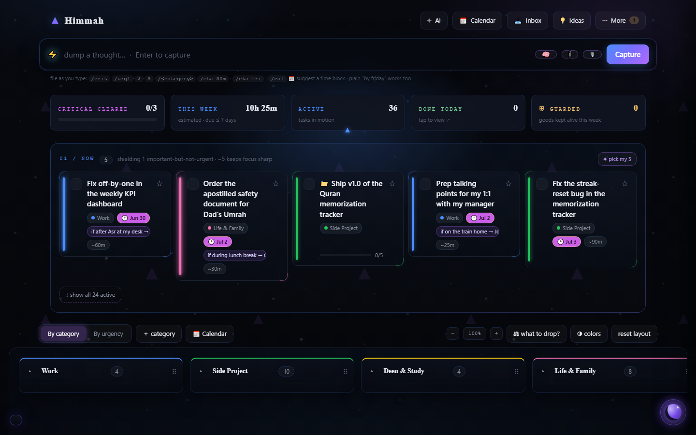
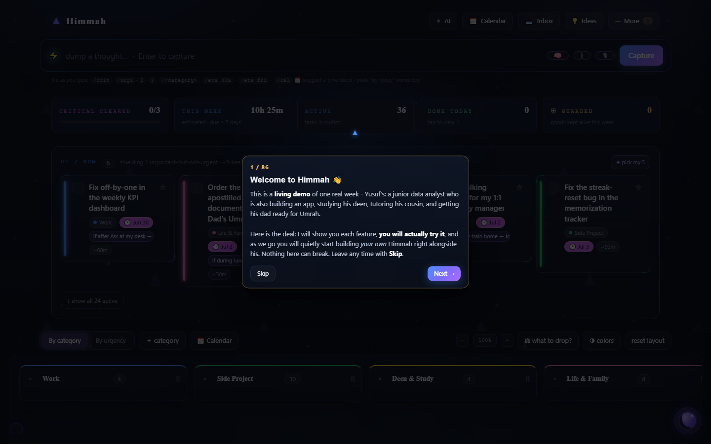

# Himmah

**Your calm home for tasks, habits and your week.**

Himmah is a local-first personal dashboard: dump whatever is on your mind, shape it into a priority-sorted board, build habits and rhythms, and plan your week around your prayers. Everything lives in one folder on your own computer - no accounts, no cloud, no tracking. The optional AI copilot runs on *your own* key, through your own machine.



## What it is

- **A capture-first to-do app.** Type a messy thought in the top bar, press Enter, and it lands in your Inbox. Paste ten lines and you get ten thoughts. Sorting comes later - capture never waits.
- **A board that surfaces what matters.** The **NOW** strip auto-picks your ~5 most important things so a long list never buries the urgent ones. Below it, your whole life lays out by category or by urgency.
- **A prayer-aware calendar.** Day and week views are built around your five daily prayers. *Calendarize* lays your tasks out around your fixed commitments.
- **Habits and rhythms, kept separate.** Habits take willpower and get streaks. Rhythms are the gentle automatic things (sleep on time, adhkar after salah) and get soft miss-tracking instead of guilt.
- **A Guardian** that protects the things that keep you alive - sleep, salah, family time - when your week gets greedy.
- **An Idea Parking Lot** so sparks don't die in your task list: park them, sort them, and let the AI enrich the ones worth growing.
- **Naseer, the AI copilot** (optional): a chat assistant that can add and shape tasks, answer questions about your week, and talk to you out loud - it always asks before touching anything. Plus one-tap AI helpers everywhere: enhance a vague title, estimate time, suggest an if-then next step, split a big task into steps.
- **History for everything.** Every save is snapshotted; the in-app History panel restores any earlier state. Restoring is itself undoable.
- **Plain tech, zero dependencies.** One stdlib-Python server (`server.py`), one HTML file, vanilla JS and CSS. Nothing to install beyond Python 3.

## Quick start (Windows)

**Easiest:** grab the ZIP from [Releases](../../releases), unzip it anywhere, and double-click **`Start Himmah.bat`**. It finds (or auto-installs) Python 3, starts Himmah at `http://127.0.0.1:7777/`, and opens your browser. Keep the black window open while you use the app; close it to stop.

**From a clone:**

```
git clone https://github.com/enislucas/himmah
cd himmah
py server.py
```

then open `http://127.0.0.1:7777/`. On macOS or Linux use `python3 server.py` - the server is pure standard-library Python, though Windows is the tested path.

## Your first ten minutes

First launch drops you into a **living demo**: one real week belonging to Yusuf - a junior data analyst who is building an app, studying his deen, tutoring his cousin, and getting his dad ready for Umrah. A **guided, hands-on tour** (86 short cards, in chapters, skippable any time) walks you through every feature by having you *actually do it* - capture a thought, shape it in the editor, drag it onto the calendar, park an idea, talk to Naseer.



When you are ready to make it yours, hit **☢ Make it yours** (offered at the end of the tour, and always available under the **✦ AI** menu). It clears the demo and walks you through building *your* board with a short guided conversation: your habits, your rhythms, your life areas, whatever is on your plate right now.

## Switching on the AI (optional, ~2 minutes)

Himmah works fully without any AI - every feature has a non-AI path. To switch the smart parts on:

1. Open the **`Setup Guides`** folder and follow **START HERE.html**.
2. Guide 1 walks you through getting a **DeepSeek API key** (pay-as-you-go, no subscription) and saving it as `data/deepseek_key.txt`.
3. That's it. Spend is hard-capped in-app at roughly **10 cents a day**, and the app shows you exactly what each AI action costs.

Guide 2 (optional, ~10 min) adds one-click **Google Meet links** on calendar events.

**Privacy, plainly:** your key lives in one file on your disk and is read only by your local server. The browser side of Himmah never talks to the internet - every AI call goes through your own `server.py`, and only the text needed for that one action is sent to the AI provider. No key, no calls, nothing leaves your machine. (If you fork this repo: `data/deepseek_key.txt` is git-ignored so your key cannot be committed by accident, but treat the rest of `data/` as personal once you have used the app - don't push your own tasks to a public fork.)

## What's in the folder

| Path | What it is |
|---|---|
| `server.py` | The whole backend - one stdlib-Python file. |
| `index.html`, `app.js`, `styles.css` | The whole frontend - plain web, no framework, no build step. |
| `Start Himmah.bat` | Windows launcher (finds or installs Python, starts the server, opens the app). |
| `Setup Guides/` | The two optional online-feature guides + START HERE. |
| `data/tasks.json` | **Your data.** Ships as Yusuf's demo week; *Make it yours* replaces it with your life. |
| `data/snapshots/` | Automatic version history - powers the in-app History panel. |
| `data/prayer_times.json` | The prayer timetable the calendar plans around (editable). |
| `READ ME FIRST.html` | The non-technical intro that ships in the release ZIP (written for someone handed the ZIP by a friend). |
| `LICENSE.txt` | Copyright and terms. |

## License

Copyright (c) 2026 Enis Lucas Ziadin. All rights reserved. This is **source-available, not open source**: the code is published here to be read and evaluated, and [`LICENSE.txt`](LICENSE.txt) is the operative text - it reserves all rights, so for any use beyond what GitHub's terms already allow for public repositories (viewing and forking on GitHub), including redistributing Himmah or building on it, please ask the author first.
